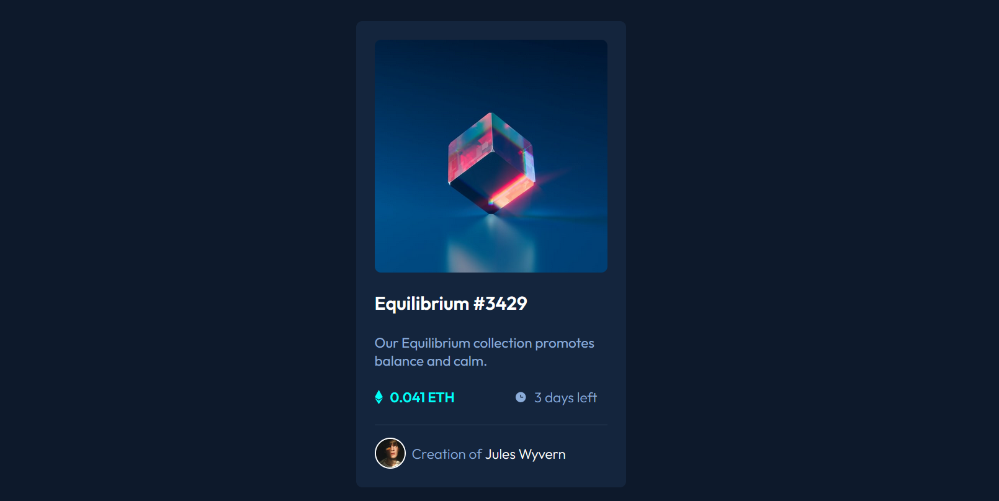

# Frontend Mentor - NFT preview card component solution

This is a solution to the [NFT preview card component challenge on Frontend Mentor](https://www.frontendmentor.io/challenges/nft-preview-card-component-SbdUL_w0U). Frontend Mentor challenges help you improve your coding skills by building realistic projects. 

## Table of contents

- [Overview](#overview)
  - [The challenge](#the-challenge)
  - [Screenshot](#screenshot)
  - [Links](#links)
- [My process](#my-process)
  - [Built with](#built-with)
  - [What I learned](#what-i-learned)
  - [Continued development](#continued-development)
  - [Useful resources](#useful-resources)
- [Author](#author)

## Overview

### The challenge

Users should be able to:

- View the optimal layout depending on their device's screen size
- See hover states for interactive elements

### Screenshot


### Links

[Deploy - github pages](https://tauanecustodio.github.io/frontend_mentor/nft_preview_card_component)

## My process

### Built with

- Semantic HTML5 markup
- CSS custom properties
- Flexbox

### What I learned

- I learned how to use ```:hover``` to overlay images;
- And how to use the ```<article>``` tag

### Continued development

I want to delve deeper into the possibilities of using the ```:hover``` element

### Useful resources

- [How to Create an Image Overlay Hover Effects with CSS?](https://www.scaler.com/topics/css-hover-effects-image/) - This article helped me create the effect in the main image in which another image appears above

## Author

- Frontend Mentor - [@tauanecustodio](https://www.frontendmentor.io/profile/TauaneCustodio)