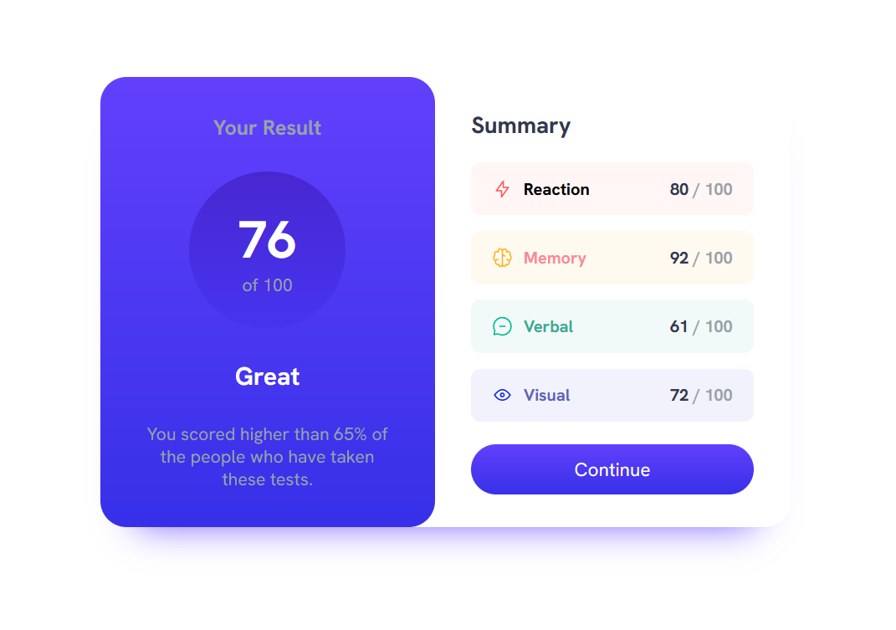

# Frontend Mentor - Results summary component solution

This is a solution to the [Results summary component challenge on Frontend Mentor](https://www.frontendmentor.io/challenges/results-summary-component-CE_K6s0maV). Frontend Mentor challenges help you improve your coding skills by building realistic projects. 

## 📑 Table of contents

- [Overview](#overview)
  - [The challenge](#the-challenge)
- [My process](#my-process)
  - [Build with](#built-with)
  - [What I learned](#what-i-learned)

## Overview

### The challenge🎯

Users should be able to:

- View the optimal layout for the interface depending on their device's screen size
- See hover and focus states for all interactive elements on the page

### Screenshot📷

## My process

### Built with👩🏻‍💻

- Semantic HTML5 markup;
- CSS custom properties;
- Flexbox;

### What I learned💡

- I learned how to use the scale property to not break other elements when I want to increase the size on hover.
- Organizing the colors before starting the project makes the process much easier, organizing them in the middle or at the end is very complicated.